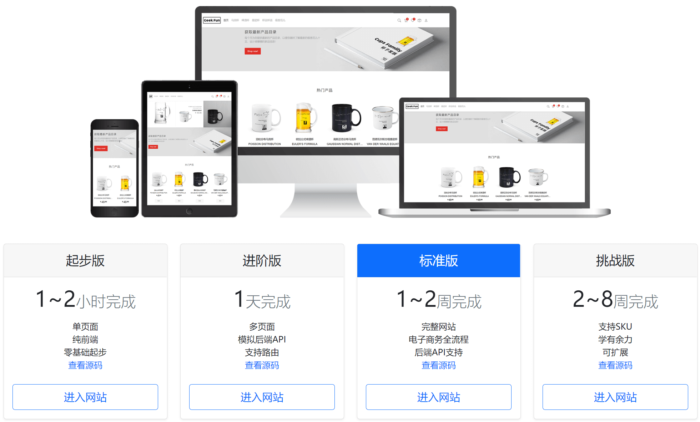
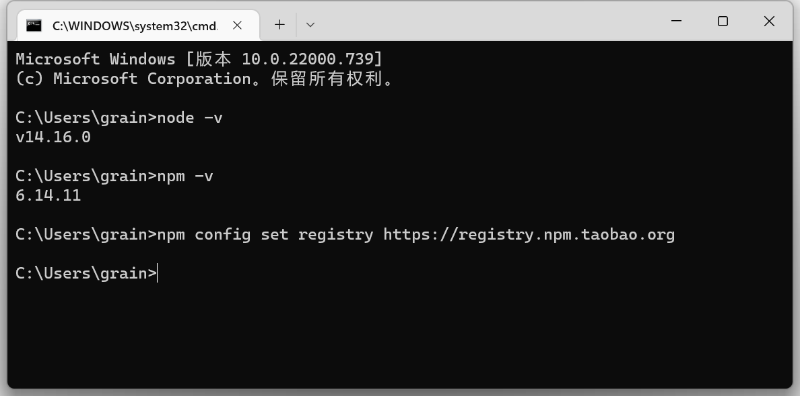
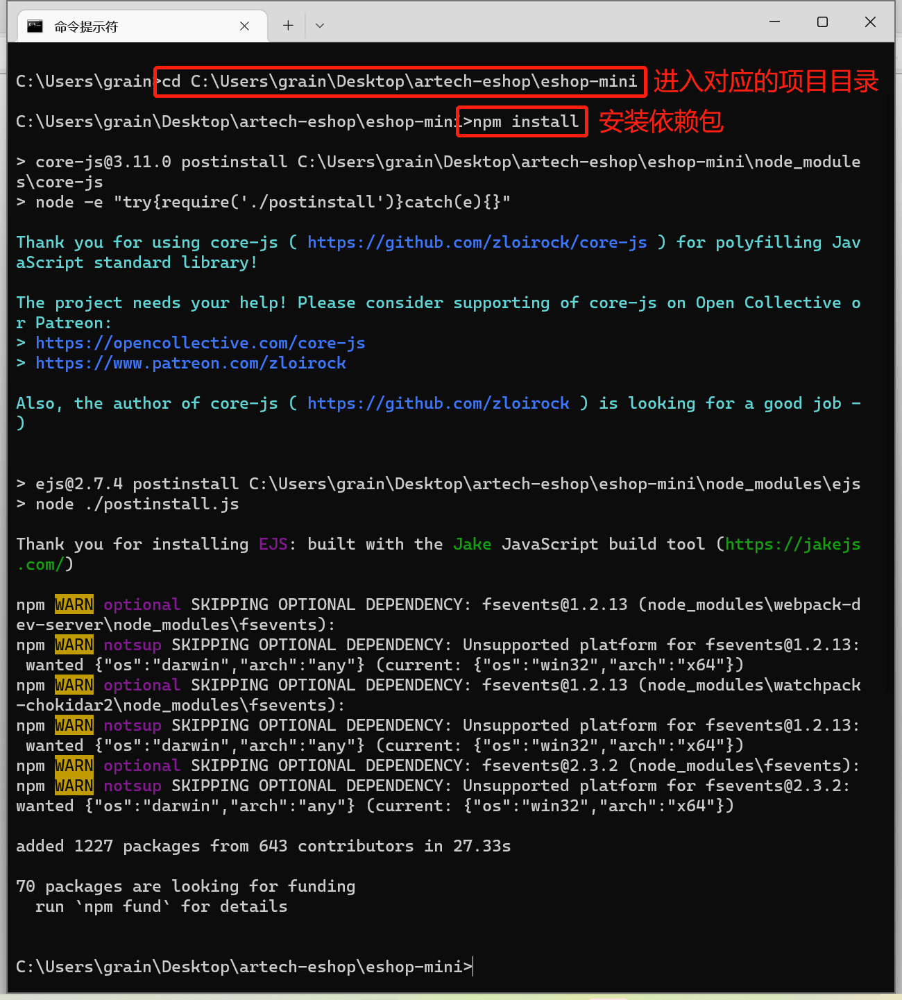
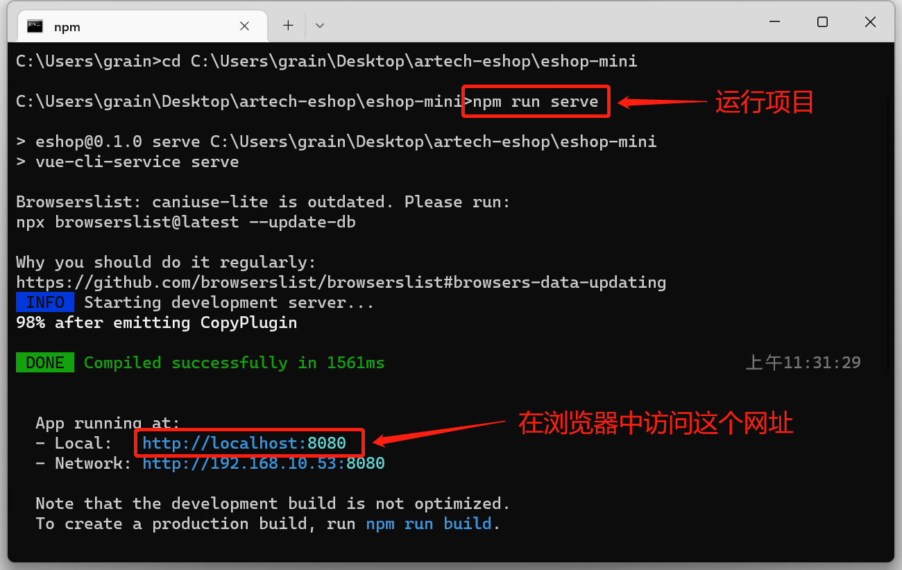
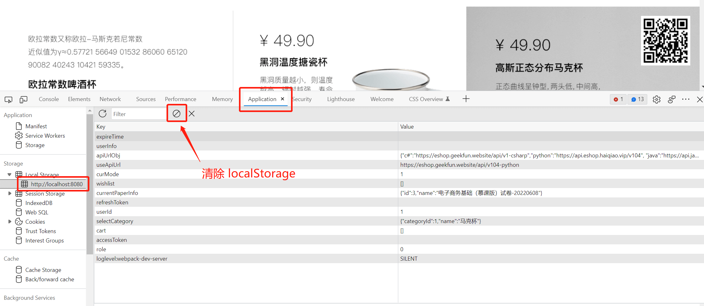

# GeekFun 极客范

“极客范(GeekFun)”是一套完整的可扩展Web开发项目范例，供广大学习者使用。通过开发这个项目，可以学习到完整的Web开发相关技术，掌握完整的Web开发工具栈。具体介绍请访问网站：<http://www.geekfun.website/>。



本仓库是这四个版本的前端源代码：

- 起步版：[eshop-starter](eshop-starter)
- 进阶版：[eshop-mini](eshop-mini)
- 标准版：[eshop](eshop)
- 挑战版：[eshop-plus](eshop-plus)

前端用到的主要工具和框架：

- Vue.js 2
- Bootstrap5
- Vuex
- VueRouter
- Sass
- Axios

其中标准版和挑战版需要后端支持，为了方便前端开发人员使用，我们提供了在线的API接口，已经在项目中配置好了，直接运行项目即可。接口文档如下：

- 标准版API: <https://eshop.geekfun.website/api/v1-csharp/swagger/index.html>
- 挑战版API: <https://plus.geekfun.website/api/v1-csharp/swagger/index.html>

后端源代码也会陆续开源出来，敬请期待。

## 如何运行项目

这四个版本是独立的项目，每个需要单独运行，运行方式都是相同的。在运行之前，需要先配置一下开发环境。

**第一步**：配置环境

安装 node.js v14+，从官网下载并安装最新版即可。安装完成后，在命令行窗口中输入如下命令，检验是否安装成功。



接着配置npm，通过下面的命令将npm配置成国内的源，能大大加快安装依赖包的速度。

```
npm config set registry https://registry.npm.taobao.org
```

**第二步**：安装依赖包

```
cd eshop-mini #进入对应版本的项目目录
npm install
```



**第三步**：本机运行

```
npm run serve
```




## 注意事项

1、标准版和挑战版不要同时运行。

这个两个项目需要在localStorage中存储一些数据，同时运行会有冲突。因此，这两个项目切换运行的时候，需要先清除localStorage。清除方法如下，打开浏览器的控制台（快捷键`Ctrl+Shift+I`），然后按下图操作。


