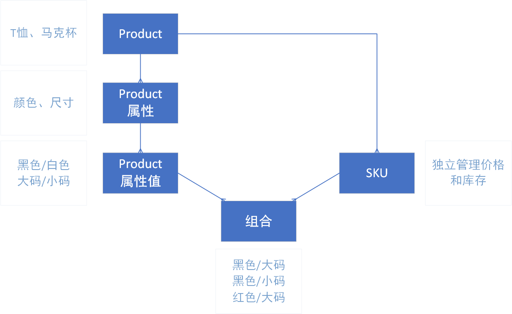

# 数据库设计

## 商品模块

- `标签 tag`:

    | 字段名        | 类型       | 最大长度 | 可空 | 外键 | 唯一 | 其他约束 | 说明   |
    |------------|----------|------|----|----|----|------|------|
    | tag_id     | int      |      |    |    | 唯一 |      | 自增主键 |
    | name       | varchar  | 32   |    |    | 唯一 |      |      |
    | rank       | datetime |      |    |    |    |      |      |

- `产品类别 category`: 

    | 字段名        | 类型       | 最大长度 | 可空 | 外键 | 唯一 | 其他约束 | 说明   |
    |------------|----------|------|----|----|----|------|------|
    | category_id  | int      |      |    |    | 唯一 |      | 自增主键 |
    | name         | varchar  | 32   |    |    | 唯一 |      |      |
    | rank         | int      |      |    |    |    |      |      |

- `产品 product`: 

    | 字段名         | 类型       | 最大长度 | 可空 | 外键          | 唯一 | 其他约束 | 说明   |
    |-------------|----------|------|----|-------------|----|------|------|
    | product_id   | int      |      |    |             | 唯一 |      | 自增主键 |
    | name         | varchar  | 128  |    |             |    |      |      |
    | summary      | varchar  | 512  | 可空 |             |    |      |      |
    | description  | longtext |      | 可空 |             |    |      |      |
    | is_published | tinyint  |      |    |             |    |      |      |
    | is_deleted   | tinyint  |      |    |             |    |      |      |
    | rank         | int      |      |    |    |    |      |      |
    | feature      | int      |      |    |             |    |      | 枚举 |
    | category_id  | int      |      |    | 外键 |    |      |      |
    |default_sku_id| int      |      |    | 外键 |    |      |      |
    | create_time  | datetime |      |    |             |    |      |      |
    | score        | decimal\(18,2\) |    | 可空   |             |    |      |      |

    ```c#
    # feature字段枚举定义(c#)
    [Flags]
    enum Feature
    {
        None        = 0,
        Recommended = 1,   //推荐
        New         = 2,   //新品
        Popular     = 4   //热销
    }
    ```
- `产品标签 product_tag_mapping`: 

    | 字段名       | 类型  | 最大长度 | 可空 | 外键          | 唯一 | 其他约束                   | 说明 |
    |-----------|-----|------|----|-------------|----|------------------------|----|
    |product_tag_mapping_id| int |      |    |      | 唯一 |      | 自增主键 |
    | product_id           | int |      |    | 外键 |      | product_id,tag_id联合唯一性约束 |    |
    | tag_id               | int |      |    | 外键 |      | product_id,tag_id联合唯一性约束 |    |

- `产品属性 product_attribute`:

    | 字段名        | 类型       | 最大长度 | 可空 | 外键          | 唯一 | 其他约束 | 说明   |
    |------------|----------|------|----|-------------|----|------|------|
    | product_attribute_id | int      |      |    |             | 唯一 |      | 自增主键 |
    | name                 | varchar  | 32   |    |             |    |      |      |
    | rank                 | int      |      |    |             |    |      |      |
    | product_id           | int      |      |    | 外键 |    |      |      |

- `产品属性值 product_attribute_value`:

    | 字段名                | 类型      | 最大长度 | 可空 | 外键                   | 唯一 | 其他约束 | 说明   |
    |--------------------|---------|------|----|----------------------|----|------|------|
    | product_attribute_value_id | int     |      |    |      | 唯一 |      | 自增主键 |
    | name                       | varchar | 32   |    |      |    |      |      |
    | rank                       | int     |      |    |      |    |      |      |
    | product_attribute_id       | int     |      |    | 外键 |    |      |      |

- `sku`: 

    | 字段名              | 类型              | 最大长度 | 可空 | 外键                 | 唯一 | 其他约束 | 说明   |
    |------------------|-----------------|------|----|--------------------|----|------|------|
    | sku_id            | int             |      |    |    | 唯一 |      | 自增主键 |
    | name              | varchar         | 128  |    |    |    |      |      |
    | price             | decimal\(18,2\) |      |    |    |    |      |      |
    | stock             | int             |      |    |    |    |      |      |
    | product_id        | int             |      |    | 外键 |    |      |      |
    |product_picture_id | int             |      | 可空 | 外键 |    |      |      |

- `sku_attribute_value_mapping`: 

    | 字段名                     | 类型  | 最大长度 | 可空 | 外键                        | 唯一 | 其他约束                                 | 说明 |
    |-------------------------|-----|------|----|---------------------------|----|--------------------------------------|----|
    | sku_attribute_value_mapping_id | int |   |    |    | 唯一 |      | 自增主键 |
    | attribute_value_id             | int |     |    | 外键 |    | sku_id, attribute_value_id联合唯一性约束 |    |
    | sku_id                         | int |      |    | 外键 |    | sku_id, attribute_value_id联合唯一性约束 |    |

- `产品图片 product_picture`:

    | 字段名        | 类型       | 最大长度 | 可空 | 外键          | 唯一 | 其他约束 | 说明   |
    |------------|----------|------|----|-------------|----|------|------|
    | product_picture_id | int      |      |    |    | 唯一|      | 自增主键 |
    | name               | varchar  | 128  |    |    |    |      |      |
    | image_key          | varchar  | 100  |    |    |    |      |      |
    | is_deleted         | tinyint  |      |    |    |    |      |      |
    | rank               | int      |      |    |    |    |      |      |
    | product_id         | int      |      |    |外键|    |      |      |



## 购物模块

- `购物车 cart_item`:

    | 字段名         | 类型   | 最大长度 | 可空 | 外键 | 唯一 | 其他约束 | 说明            |
    |-------------|----------|------|----|----|----|------|---------------|
    | cart_item_id| int      |      |    |    | 唯一 |      | 自增主键 |
    | user_id     | int   |      |    |    |    |      | 非外键; sku_id, user_id联合唯一性约束 |
    | sku_id      | int      |      |    |    |    |      | 非外键; sku_id, user_id联合唯一性约束 |
    | count       | int      |      |    |    |    |      |               |
    | description | json     |      |可空|    |    |      | JSONField     |

- `商品心愿单 wishlist`: 

    | 字段名         | 类型       | 最大长度 | 可空 | 外键 | 唯一 | 其他约束 | 说明            |
    |--------------|---------|------|----|----|----|------|---------------|
    | cart_item_id | int     |      |    |    |唯一|      | 自增主键 |
    | user_id      | int  |      |    |    |    |      | 非外键; sku_id, user_id联合唯一性约束 |
    | sku_id       | int     |      |    |    |    |      | 非外键; sku_id, user_id联合唯一性约束 |
    | description | json     |      |可空|    |    |      | JSONField     |

- `订单 order`: 

    | 字段名             | 类型              | 最大长度 | 可空 | 外键 | 唯一 | 其他约束 | 说明       |
    |-----------------|-----------------|------|------|----|----|------|----------|
    | order_id        | bigint          |      |      |    | 唯一 |     | 主键, 非自增     |
    | user_id         | int          |      |      |    |    |      | 非外键 |
    | order_status    | smallint        |      |      |    |    |      | 枚举 |
    | order_time      | datetime        |      |      |    |    |      |          |
    | total_price     | decimal\(18,2\) |      |      |    |    |      |          |
    | user_name       | varchar         | 32   |      |    |    |      |          |
    | phone_number    | varchar         | 32   |      |    |    |      |          |
    | province        | varchar         | 16   | 可空 |    |    |      |          |
    | city            | varchar         | 16   | 可空 |    |    |      |          |
    | street          | varchar         | 256  |      |    |    |      |          |
    | pay_time        | datetime        |      | 可空 |    |    |      |          |
    | pay_price       | decimal\(18,2\) |      | 可空 |    |    |      |          |
    | pay_method      | varchar         | 16   | 可空 |    |    |      |          |
    | pay_sign        | varchar         | 512  | 可空 |    |    |      |          |
    | shipping_time   | datetime        |      | 可空 |    |    |      |          |
    | shipping_no     | varchar         | 32   | 可空 |    |    |      |          |
    | shipping_company| varchar         | 32   | 可空 |    |    |      |          |
    | memo            | varchar         | 512  | 可空 |    |    |      |          |
    | cancel_time     | datetime        |      | 可空 |    |    |      |          |

- `订单明细 order_item`:

    | 字段名         | 类型              | 最大长度 | 可空 | 外键        | 唯一 | 其他约束 | 说明            |
    |-------------|-----------------|------|----|-----------|----|------|---------------|
    |order_item_id| int             |      |    |           | 唯一 |      | 自增主键          |
    | sku_id      | int             |      |    |           |    |      | 非外键 |
    | price       | decimal(18,2) |      |    |           |    |      | sku单价 |
    | count       | int             |      |    |           |    |      | sku数量 |
    | description | json            |      |可空|           |    |      | JSONField     |
    | order_id    | bigint          |      |    | 外键      |    |      |               |

- `订单编号池 order_id_pool`: 

    | 字段名             | 类型              | 最大长度 | 可空 | 外键 | 唯一 | 其他约束 | 说明       |
    |-----------------|-----------------|------|------|----|----|------|----------|
    | order_id_pool_id| int             |      |      |    | 唯一 |      | 自增主键       |
    | order_id        | bigint          |      |      |    | 唯一 |     | range(1000000, 9999999)  |
    | used_time       | datetime        |      |  可空|    |    |      |          |

- `订单状态：待支付、待发货、已发货、已取消`

    ```python
    # 参考python中的枚举定义
    class OrderStatus(models.IntegerChoices):
        DAIZHIFU = 0, '待支付'
        DAICHULI = 1, '待发货'
        DAIFAHUO = 2, '已发货'
        YIWANCHENG = 3, '已取消'
    ```

## 促销模块

- `折扣 Discount`: Id, Name, CouponCode, RequireCouponCode, Description, DiscountType, DiscountValue, 

   UpTo, AtLeast, ValidFrom, ValidTo, MaxTimesTotal, MaxTimePerUser, Closed

   ShippingFree, CreateTime

- `产品折扣 DiscountToProduct`: DiscountId, ProductId

- `SKU折扣 DiscountToSku`: DiscountId, SkuId

- `产品类别折扣 DiscountToCatalog`: DiscountId, CatalogId

- `用户折扣 DiscountToUser`: DiscountId, UserId

- `折扣使用记录 DiscountLog`: Id, DiscountId, OrderId, UserId, CreateTime

## 文章模块

- `文章 article`: 

    | 字段名               | 类型     | 最大长度 | 可空 | 外键 | 唯一 | 其他约束 | 说明        |
    |----------------------|----------|------|----|----|----|------|-----------|
    | article_id         | int      |    |    |    | 唯一 |      |  自增主键  |
    | subject             | varchar  | 128  |    |    |  |      |           |
    | cover               | varchar  | 100  | 可空 |    |  |      |
    | abstract               | varchar  | 1000  | 可空 |    |  |      |
    | content             | longtext |   |  |    |    |      |   HTML文本  |
    | create_time | datetime |   |    |    |  |      |         |
    | update_time | datetime |      |    |    |    |      |         |
    | is_published | tinyint  |    |  |    |  |      |           |
    | is_deleted  | tinyint  |    |  |    |  |      |           |
    | user_id        | int      |      |    |    |    |     |        |
    | score              | decimal\(18,2\) |    | 可空   |             |    |      |      |

- `标签 tag`:

    和产品的标签表分开，不用同一个表。

    | 字段名 | 类型    | 最大长度 | 可空 | 外键 | 唯一 | 其他约束 | 说明     |
    | ------ | ------- | -------- | ---- | ---- | ---- | -------- | -------- |
    | tag_id | int     |          |      |      | 唯一 |          | 自增主键 |
    | name   | varchar | 32       |      |      | 唯一 |          |          |

- `文章标签 article_tag_mapping`: 

    | 字段名       | 类型  | 最大长度 | 可空 | 外键          | 唯一 | 其他约束 | 说明 |
    |-----------|-----|------|----|-------------|----|------------------------|----|
    | article_tag_mapping_id | int |  |  |  | 唯一 |  | 自增主键 |
    | article_id | int |      |    | 外键 |    | article_id,tag_id联合唯一性约束 |    |
    | tag_id | int |      |    | 外键   |    | article_id,tag_id联合唯一性约束 |    |

## 评论模块

- `评论对象 app`: 

    | 字段名               | 类型     | 最大长度 | 可空 | 外键 | 唯一 | 其他约束 | 说明        |
    |----------------------|----------|------|----|----|----|------|-----------|
    | app_id          | int      |      |    |    | 唯一 |      | 自增主键  |
    | name              | varchar  | 100  |    |    |    |      | 'product' 或 'article' |

- `评论 comment`: 

    | 字段名               | 类型     | 最大长度 | 可空 | 外键 | 唯一 | 其他约束 | 说明        |
    |----------------------|----------|------|----|----|----|------|-----------|
    | comment_id  | int      |      |    |    | 唯一 |      | 自增主键  |
    | content              | varchar  | 512  |    |    |    |      | 纯文本        |
    | score               | decimal(18,2)      |      | 可空 |    |    |      | 评分 1-5分     |
    | user_id        | int      |      |    |    |    |     |        |
    | create_time | datetime |      |    |    |  |      |         |
    | app_id               | int      |      |    |  外键  |    |      |           |
    | object_id            | int      |      |    |    |    |      |           |
    | is_deleted  | tinyint  |      |    |    |    |      | 软删除      |

- `回复 reply`: 

    | 字段名               | 类型     | 最大长度 | 可空 | 外键 | 唯一 | 其他约束 | 说明        |
    |----------------------|----------|------|----|----|----|------|-----------|
    | reply_id           | int      |      |    |    | 唯一 |      | 自增主键  |
    | comment_id   | int      |      |    |  外键  |    |      |           |
    | content        | varchar  | 512  |    |    |    |      | 纯文本        |
    | user_id        | int      |      |    |    |    |     |        |
    | create_time | datetime |      |    |    |  |      |         |
    | is_deleted   | tinyint  |      |    |    |    |      | 软删除      |

## 用户模块

- `用户 user`: 

    | 字段名                  | 类型       | 最大长度 | 可空 | 外键 | 唯一 | 其他约束 | 说明        |
    |----------------------|----------|------|----|----|----|------|-----------|
    | user_id               | int   |      |      |    | 唯一 |      |  自增主键  |
    | username              | varchar  | 128  | 可空 |    |  |      | 不唯一 |
    | avatar                | varchar  | 100  | 可空 |    |  |      | 不唯一 |
    | phone_number          | varchar  | 32   |      |    | 唯一 |      | 用手机号登录|
    | password              | varchar  | 128  |      |    |    |      |           |
    | register_time         | datetime |      |      |    |    |      |           |
    | last_login_time       | datetime |      | 可空 |    |    |      |           |
    | receiver_phone_number | varchar  | 32   | 可空 |    |    |      |          |
    | receiver_user_name    | varchar  | 32   | 可空 |    |    |      |          |
    | receiver_province     | varchar  | 16   | 可空 |    |    |      |          |
    | receiver_city         | varchar  | 16   | 可空 |    |    |      |          |
    | receiver_street       | varchar  | 256  | 可空 |    |    |      |          |


- `角色 Role`: Id, Name

- `用户角色 UserRoles`: UserId, RoleId

- `RefreshTokens`: Id, UserId, Token, CreateTime, ExpiresTime, RevokeTime?, Ip, UserAgent, NextTokenId?

- `第三方登录 UserLogins`: UserId, LoginProvider, ProviderKey

