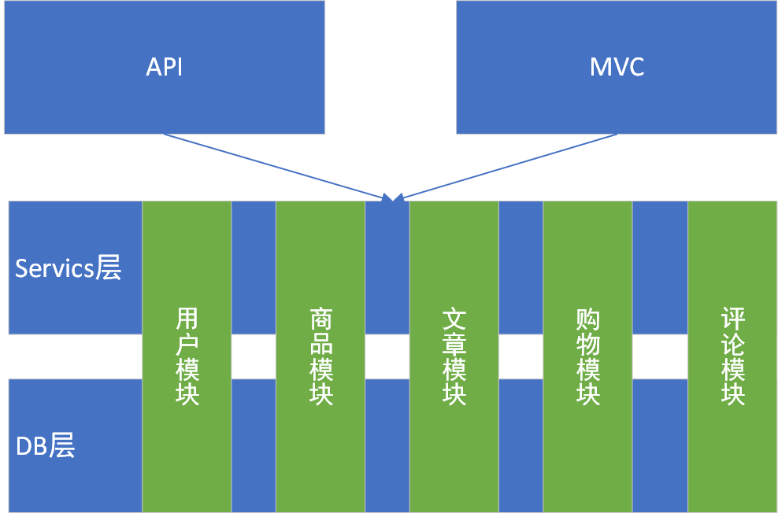

# 架构设计

模块化的单体应用，不同模块的数据库是隔离的，模块可以任意组合。

每个模块的Service层的接口是稳定的，模块直接通过依赖注入的方式调用，不能直接依赖其他模块的DbContext。

后端提供稳定的API，不同的案例可以使用不同的接口组合。

## 以下地方应该统一处理

- 模型绑定
- 模型验证
- 获取分页数据
- 错误处理
- 配置管理：数据库链接、微信支付、JWT、日志